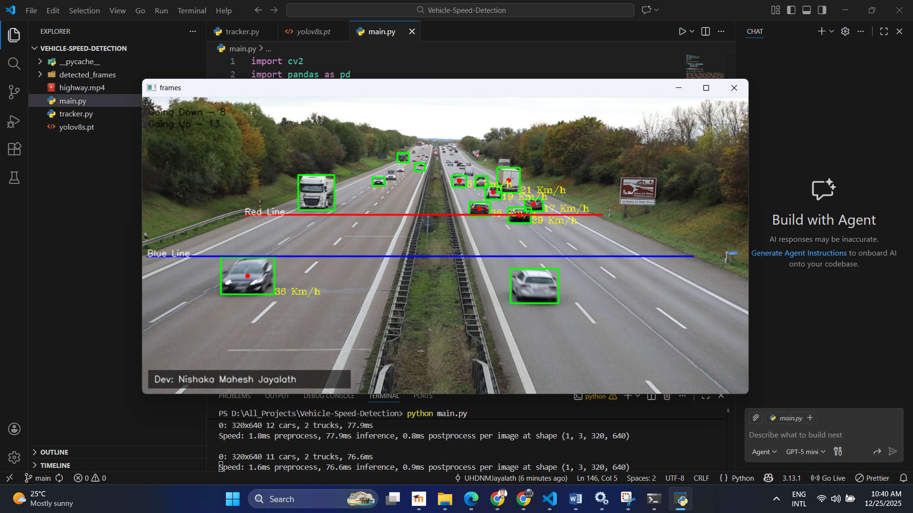

# 🚗 Real-time Vehicle Speed Detection System


A computer vision project that detects vehicles on a highway and estimates their speed in real-time. This system utilizes **YOLOv8** for object detection and a custom **Tracker** for object tracking across frames.

## 📸 Demo Output




## 🚀 Features
* **Real-time Vehicle Detection:** Identifies Cars, Buses, and Trucks using YOLOv8.
* **Object Tracking:** Assigns unique IDs to vehicles to track their movement across frames.
* **Speed Estimation:** Calculates speed (Km/h) based on pixel distance traversed over time.
* **Direction Detection:** Identifies whether the vehicle is moving UP or DOWN.
* **Custom Branding:** Displays developer and project info on the screen.

## 🛠️ Tech Stack
* **Language:** Python
* **Computer Vision:** OpenCV (`cv2`)
* **AI Model:** Ultralytics YOLOv8 (`yolov8s.pt`)
* **Data Handling:** Pandas, NumPy

## 🧠 How it Works
1.  **Detection:** The video frame is passed to the YOLOv8 model to detect vehicles.
2.  **Tracking:** A custom `tracker.py` script assigns a unique ID to each vehicle based on its center point coordinates.
3.  **Speed Calculation:**
    * Two virtual lines (Red & Blue) are drawn on the screen.
    * When a vehicle crosses the first line, the timestamp is recorded.
    * When it crosses the second line, the time difference is calculated.
    * Formula: $Speed = \frac{Distance}{Time} \times 3.6$ (to convert m/s to Km/h).

## 📂 Project Structure

```text
├── detected_frames/    # Saved frames from the output
├── highway.mp4         # Input video file
├── main.py             # Main execution script
├── tracker.py          # Custom object tracking class
├── requirements.txt    # List of dependencies
└── README.md           # Project documentation
```


## 💻 How to Run
1.  Clone the repository:
    ```bash
    git clone [https://github.com/UHDNMJayalath/Vehicle-Speed-Detection.git](https://github.com/UHDNMJayalath/Vehicle-Speed-Detection.git)
    cd Vehicle-Speed-Detection
    ```
2.  Install dependencies:
    ```bash
    pip install ultralytics opencv-python pandas
    ```
3.  Run the main script:
    ```bash
    python main.py
    ```

## 👨‍💻 Author
**Nishaka Mahesh Jayalath**
* **LinkedIn:** [linkedin.com/in/nishaka-mahesh](https://www.linkedin.com/in/nishaka-mahesh-61255534b)
* **Organization:** Luminex Technologies

---
*This project was developed for educational and research purposes.*